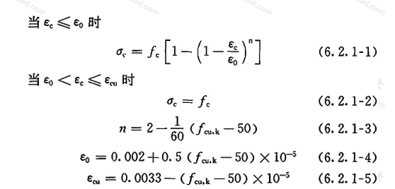
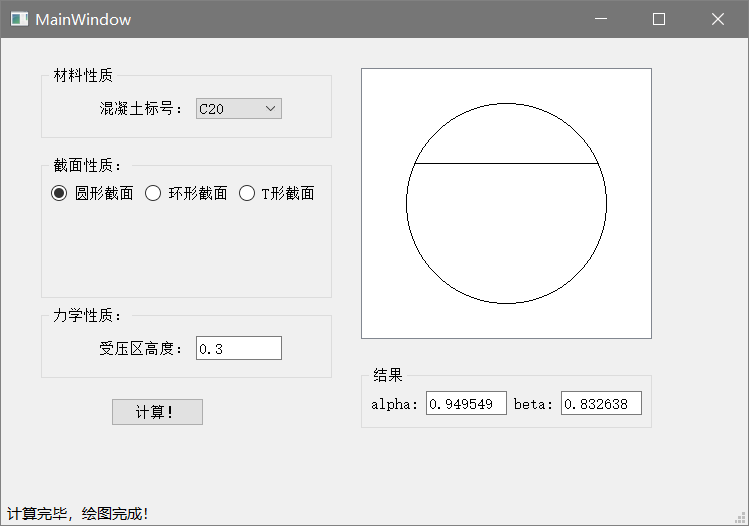
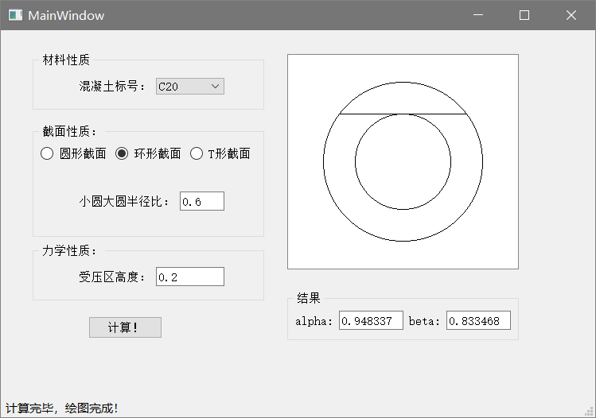
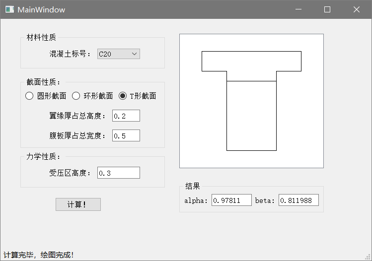

## 使用条带积分或纤维弹簧方法进行等效矩形图形系数的计算

- 选用简单的条带积分方法

首先进行一些假定

- 平截面假定
- 混凝土受压应变曲线关系满足规范所给的下式：

- 受压区峰值点达到$\varepsilon_{cu}$

## 计算过程

- 由上述假定，我们可以很轻松的计算系数。
- 首先列写平面应变关系，由应变关系推出应力关系
- 由应力关系及截面面积分布情况得出合力大小与作用点
- 此后求出力均匀分布时的合力作用点位置，并且求解方程，得到相对受压区高度。即可求出$\beta$
- 最后，由合力相等计算得出$\alpha$，整个计算流程结束

## 编写程序（技术路线）

- 为了保证效率，本程序采用C++编写，利用类关系尽可能缩减代码。
- 为了保证泛用性，采用头文件方式编写，方便后续程序引用。
- 为了便于操作，特编写图形界面，且直观给出绘图结果。方便，清晰。

## 示例

- src文件夹为源代码文件
  - `constant.h`定义了混凝土常数
  - `utilities.h`里定义了混凝土模型与各类截面的计算方法
  - `mainwindow.cpp`里实现了图形界面